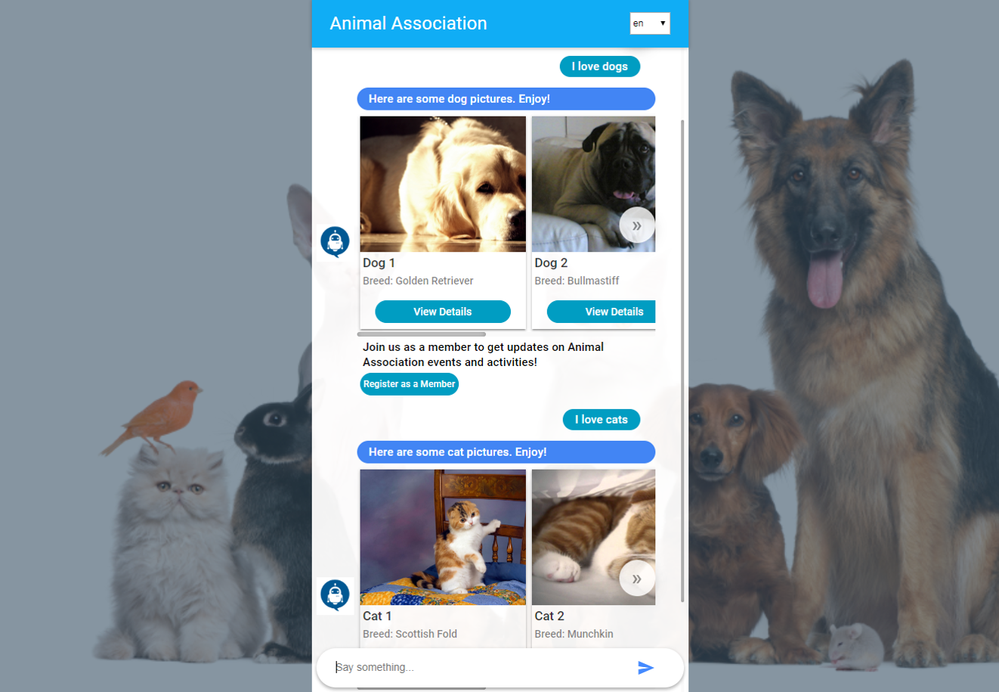
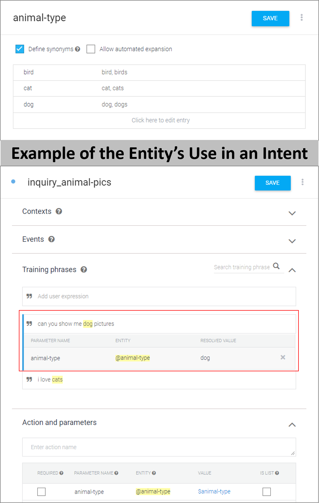
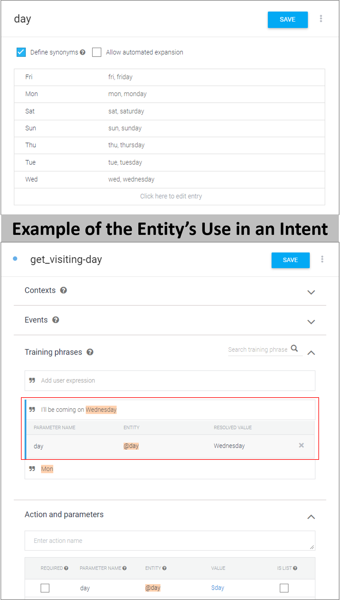
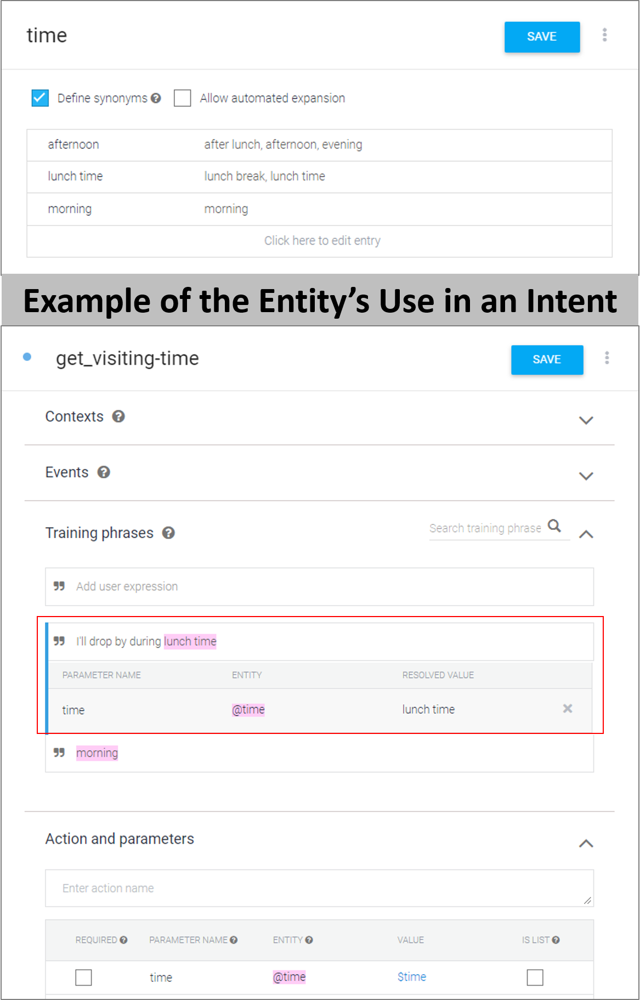
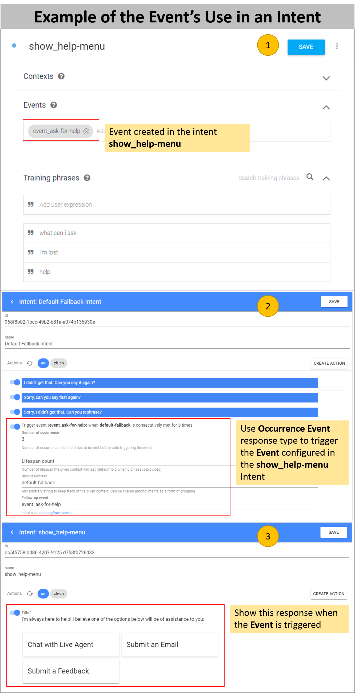
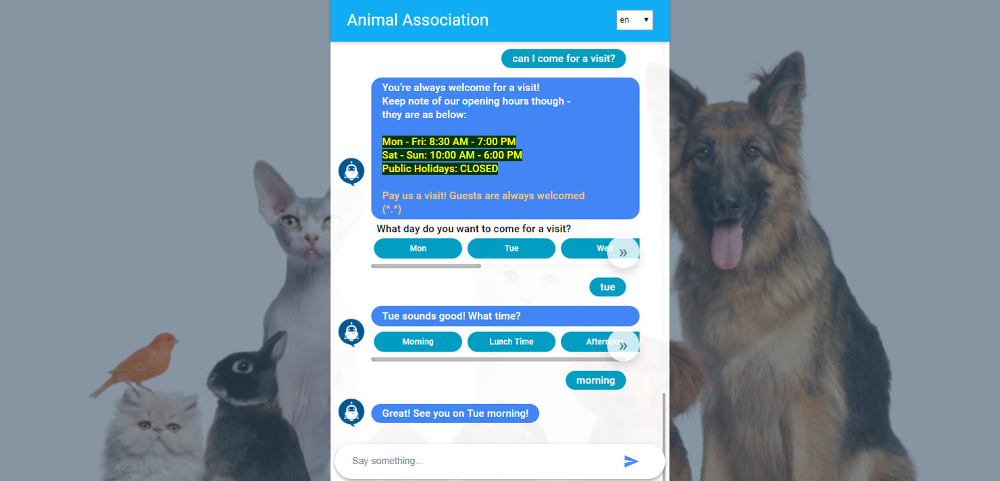
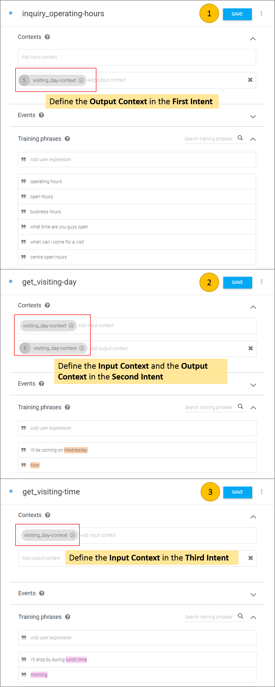

# Naming Convention

This document provides you the guideline on the naming convention best practices to apply for the:

- Intent
- Entity
- Event
- Context

Defining a good name for the Intent, Entity, Event and Context helps you to easily search it when needed, also to understand the purpose of each one of them.

## Naming Convention of an Intent

When naming an **Intent**, it is recommended to include the **action word** (i.e. verbs) as part of the **Intent Name** e.g. _inquiry_, _recommend_, _get_, _show_ and so on. 

The name of an Intent can follow the format: "**action_intent-purpose**" (**Action Name** followed by an **Underscore** and the **Intent's Purpose**, each word separated with a "-"). Below are some examples of **Intents** created based on the recommended naming convention. 

- **Inquiry**
  
  The Intent _inquiry_animal-pics_ is created to handle inquiries related to animals. It will show animal photos based on the user's preferred animal.  
    
  

  The chat results for this Intent. 
  
  

- **Recommend**

  The Intent _recommend_join-as-a-member_ is created to recommend the user to join the Animal Association as a member.   
     
  
     
  The chat results for this Intent.
   
  

- **Get**

  The Intents _get_visiting-day_ and _get_visiting-time_ are created to obtain the user's intended visiting day and time so that the Animal Shelter can book a visit session for the user.    
     
     
     
  The chat results for this Intent.   
     
  

- **Show**

  The Intents _show_quick-menu_ and _show_help-menu_ are created to show the Quick Menu to the users. Users can then pick an option shown from the Quick Menu to continue with the conversation. 
    
     
     
  The chat results for this Intent.   
     
  

## Naming Convention of an Entity

The name of an **Entity** has to be clear so that you can identify the **category of the parameter values** associated with the Intent.   
   
The name of an **Entity** can follow the format: "**category-name**" (each word in the Category Name separated with a "-").   

Below are some examples of **Entities** created based on the recommended naming convention. 

- The entity **animal-type** created to capture the value of the **Animal Type** mentioned by the user.   
   
  

- The entity **day** created to capture the value of the **Day** mentioned by the user.   
   
  

- The entity **time** created to capture the value of the **Time** mentioned by the user.   
   
  

**IMPORTANT NOTE**: When adding entries under your entities, make sure the naming system is **consistent**. As you can see from the examples above, all of the entries under a single entity are either all in lower case or use pascal case. Please make sure that all your entries under an entity follow the same naming convention!

## Naming Convention of an Event

The name of an **Event** should explain on what the event does or the action it executes.   
   
The name of an Event can follow the format: "**_event_event-purpose_**" ("**event**" prefix to represent that it is an **Event** followed by an **Underscore** and the **Event Purpose**, each word separated with a "-").

Here's an example of an **Event** created based on the above naming convention. The Intent _show_help-menu_ has an **Event** item whereby when it is triggered, it will display the Help menu to the users:

   
   
The chat results for the Event configured in the intent.   
   
   

## Naming Convention for Context

_NOTE: To learn more on how to use Context, refer to [this document](./getting-started.md) for the details._

When you need to **control the flow** of the user's conversation or **bring forward values** provided by the user into another Intent, you can use Context to achieve this.  

The name of the Context can follow the format: "**_context_action-or-purpose_**" ("**context**" prefix to represent that it is a **Context** followed by an **Underscore** and the **Context Purpose**, each word separated with a "\_" or "-").

Consider this scenario - the user asks when he can come for a visit to the Animal Shelter. Then, the bot asks the Day and Time that the user wants to pay a visit. Lastly, the bot confirms on the visit session based on the Day and Time value provided by the user.

There are two parts involved with the Context setup - the **Input Context** and the **Output Context**.   
Below is an example of the Context setup to manage the conversation as per the above example, with the naming convention in use:

