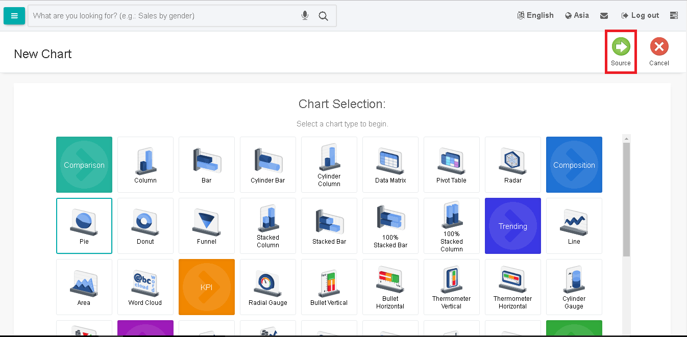
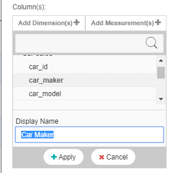
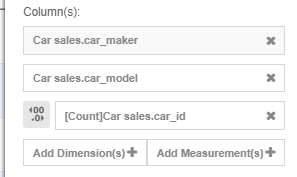
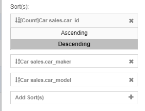
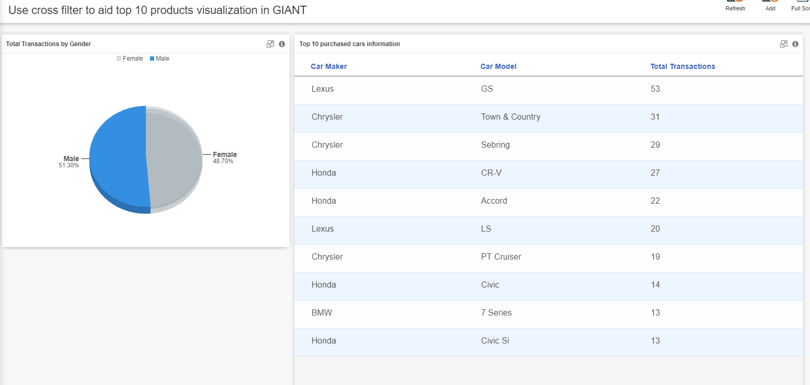

# Analysing Your Data Using Top 10 and Cross Chart Functions with GIANT 

## Introduction
This guide is to show you the top 10 and cross chart functions in GIANT and how to use it to show top 10 products in your analytics works. This guide includes instructions on:

- How to create a pie chart to show the total buyers by the gender category and a data matrix for top 10 products
- How the cross chart function aids the analysis of top 10 products bought by the buyers in each of the gender category

### Prerequisites
* Have an account to access GIANT
* A data source to use for visualization

## Uploading Source to GIANT and Creating a Dashboard
1. In case you are new to Giant, refer to [GIANT for Beginner](https://github.com/fx-giant/giant-documentations/blob/master/giant/giant-for-beginner.md) to learn on how to upload source, create a dashboard and charts in GIANT.

2. Download `Car sales.csv` in [sample-data folder](sample-data), then upload it in GIANT.

3. Create a dashboard with the name: **Cross filtering top 10 products visualization in GIANT**

### Background

Company A is in the business of selling cars. Company A wants to know the breakdown of its overall transactions by gender and the top 10 purchased cars.

### Determine the Total Transactions by Gender

Company A wants to know the total cars purchased by male and female customers. To visualise this, a Gender pie chart can be created to get a clear view on total transactions by gender

1. From your dashboard, click the `Add` icon, then choose the `Pie` chart icon and click the `Source` icon. 

    

2. Select `Car sales.csv` from `Connection Source Seletion` and click the `Proceed` icon.
3. Rename the pie chart as "Total transactions by Gender".
4. In the `Setting` area, select **gender** for the `Category-Axis` and `Count` of **order_id** for the `Value-Axis`. This is our given output:

    

5. In the `Setting` panel, scroll down and make sure that the `Cross Chart` function is turned on (as shown in the screenshot).

6. Click `Save` and choose the dashboard that you created earlier to save the pie chart into.

### Displaying Top 10 Purchased Cars Information

A data matrix is created to display the information of top 10 purchased cars (which corresponds to the number of transactions, sorted in descending order).

1. From your dashboard, click on `Add` icon, select `Data Matrix` icon and click `Source` icon. 

    

2. Choose `Car sales.csv` and click `Proceed` icon.
3. Rename the data matrix as "Top 10 purchased cars information".
4. Under the `Column(s)` section, click `Add Dimensions(s)` and choose the **car_maker** column. Rename the column label as *Car Maker* and click `Apply`.

    

5. Choose **car_model** as another dimension. Rename the column label as "Car Model" and click `Apply`.
6. Click `Add Measurement(s)` and choose `Count` of **car_id** column. Rename the column label as *Total Transactions* and click `Apply`.

    

7. Under `Sort(s)`, drag `car_id` column to the first position. Then, click it and choose `Descending`. The data matrix will display information of the cars with the highest number of transactions first.

    

8. Currently the data matrix displays the information of all cars. To display only the top 10 cars, use the `Top` function. Under `All/Top/Bottom`, click `All` and choose `Top`, enter 10 as the value and click `Set`. Now, only the top 10 products are displayed in the data matrix. 

    

### Using the Cross Chart Filter Function to Aid the Analysis

In the dashboard, the top 10 purchased cars information for both male and female customers can be seen.

Now we can use the `Cross Chart` function to visualize the top 10 purchased cars among the male customers. In the pie chart, click the Male segment to see the "magic".

By clicking on the gender segment in the pie chart, you can visualise the top 10 cars for purchased by the Male customers, Female customers or both genders of customers.

