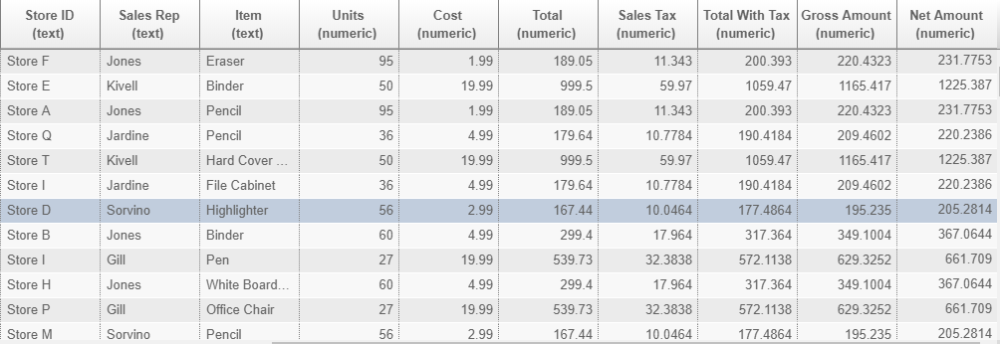
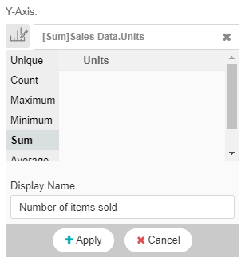
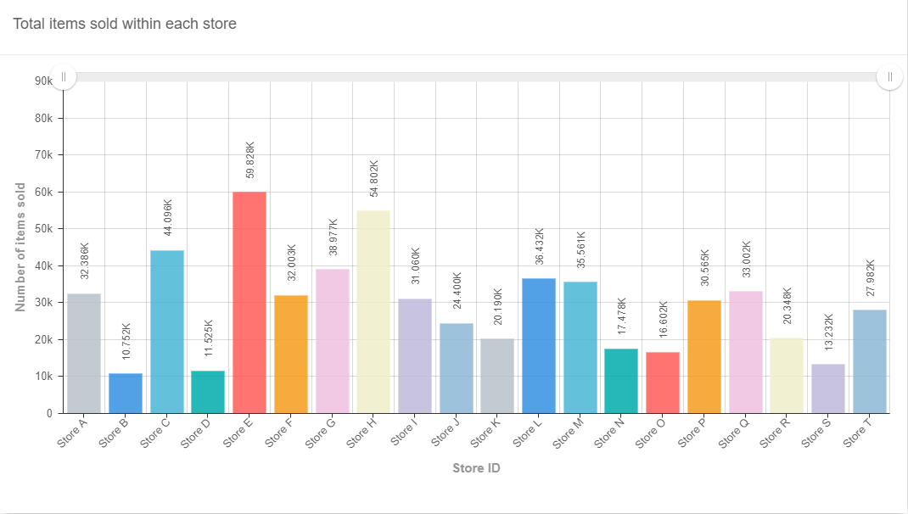
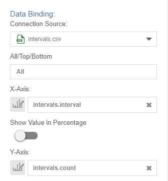
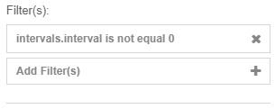
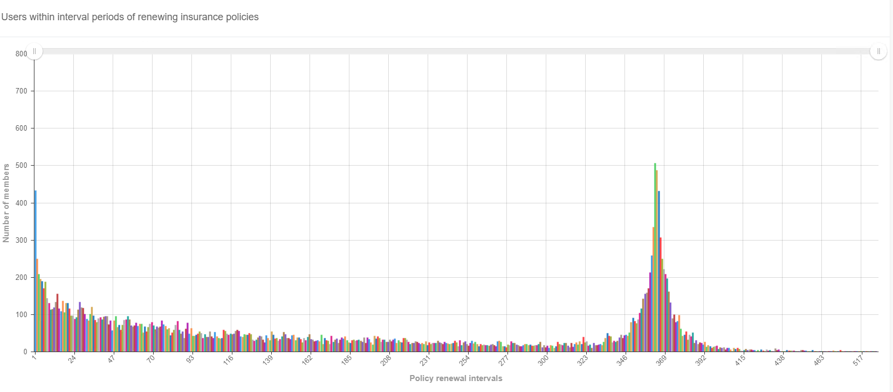

# GIANT 101: Using Bar Charts

## Introduction
Bar charts are easy to visualize and understand making it one of the most useful graphs within GIANT. This guide will show you examples of how to utilize this chart:

## Example 1

When using GIANT, it is very important to always think about the structure of your data before using it to create your chart. GIANT has many built-in functions that make it easy for you to aggregate data within the system so you might want to think about this before trying to aggregate your data externally.

In this example, I will be using a source called **Stationary Sales**.

As you can see by the columns of my data, it shows the information about different stationary items being sold. If I want to showcase the **total number of items sold within each store**, I would have to aggregate my data to create a bar chart  within GIANT. Since there are already built in functions, I can just aggregate my current data within GIANT.

First, we connect to our data source: **Stationary Sales**. The X-axis represents the different stores within my data. Since my data shows the number of **units** sold of **each specified item** from different stores, I have to use the built-in function **sum** when selecting **units** in order to get the **total number of items purchased from each store** for my Y-axis. 

Make sure to always change your **Display Name** when choosing your column for the chart axis so that the information you are showcasing is clear to your audience. In this case, I label my **[Sum]Sales Data.Units** to be **Number of items sold** because that is what I get when aggregating my data using GIANT's built in function.

The given result is as follows:

If you want to sort your bars in any specific order, you can do this by dragging the chosen data column to the top in the **Sort(s)** list. For example, if you want to sort your data by **Store ID**, the **Store ID** data column needs to be the first in the **Sort(s)** list. Whereas, if you want to sort by **Units**, the **Units** data column needs to be the first in the **Sort(s)** list. When you click on the data column, a menu is shown. You can then choose whether you want your data to be displayed in ascending or descending order.

In this case, I want to see which store has the most sales to the store who has the least sales because I want to show which store is doing the best in terms of sales. 

This is the given output:

## Example 2

In this example, I will be using a unique use case using data on **Insurance policy renewal intervals for users**. This data was aggregated externally so we will not be using any of GIANT's built-in functions.

This is the structure of the data I will be using for this example. **Interval** represents the number of days users leave between renewing their insurance policy and **count** represents the number of users who fall into that specific interval period. Given the way this data is aggregated, we are able to create a histogram.

Here we connect to our data source: **intervals.csv**. The X-axis represents the **interval** periods whilst the Y-axis represents the **number of members** that fit into each period.

In this specific case, we must add a filter for when **interval period is equal to 0** because it does not make sense for users to be able to renew insruance policies in the same day. We recognise that this may be a problem with the data given, so we filter to omit it. 

This is the given output:

However, if we want to see our histogram on a bigger scale as **intervals.csv** has more data points, we must click the **show all** button at the **top right part** of our graph.

Here is the final output of our histogram that shows the number of members within each renewal interval period. 

## GIANT's Built-In Functions

**Unique** - Counts the distinct values within the column that you choose. For example, if your data contains multiple names, it only takes into account a unique name once. This is particularly useful when wanting to know how many unique users exist in your consumer base.

**Count** - Counts the number of rows within a column.

**Maximum** - Takes the maximum value within your column.

**Minimum** - Takes the minimum value within your column.

**Sum** - Sums the numeric values within your column.

**Average** - Takes the average value within your column.

**None** - Does not affect your column. Used when your current data is already aggregated.

**Group By** - Used when you want to look at the data within different groups of your data. For example: **Sales by Store ID for different Age Groups**.

**Sort** - Sorts your data in Ascending/Descending order depending on the data type.

**Filter** - Allows you to choose columns within your table to filter our specific criteria for the data you want to show.

## Important Notes

- If you have date-time data, it would be better to showcase your data using a line-chart.

- This type of chart can only be used when your data is two dimensional thus it is important to know how your data is structured and what you want to show before you actually create a chart.

- If you have data you want to show that includes 3 dimensions, I recommend to use a different visual to show your data OR you can try the **Drill-Down** feature.

- Bar charts are normally used to show summary or overviews for comparison. So, if you want to show a large number of data points that requires legends or data labels, it may get very messy. 

- Depending on the data and use case that you want to show, you may also want to stay away from the **Group By** feature as it can make your bar chart messy and difficult for the audience to understand.

In this example, I show the **total sales within each region grouped by the store which the items are sold from**. What I want to show requires both legends and data labels so it isn't ideal that I use this bar chart as it makes the data very messy and difficult to read.
