# GIANT 101 : Using combination charts:

## Introduction:

Combination Charts give users a variety of options to choose what graphs to combine. It is especially useful when making comparisons and summarizing your data. This guide will show examples of how to use this chart.

## Example 1 - Combination Charts:

In this example, we will be using a source called **Stationary Sales**.

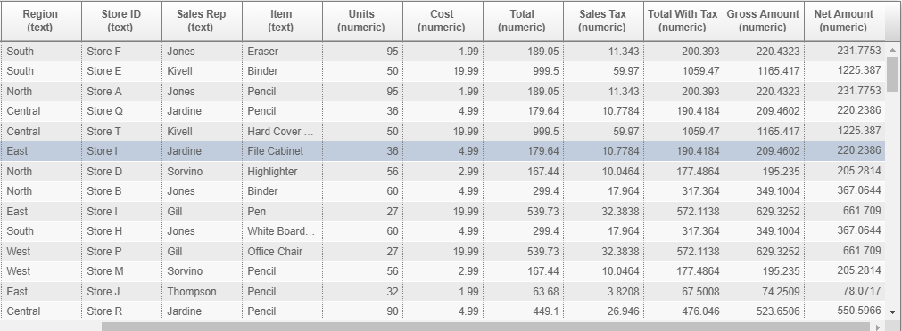

This data shows information about different stationary items sold. Using the combination charts, we will be showing the **total revenue against cost among regions**. This can be important to companies as this information can provide better understanding about their revenue and costs among stores within each region. Given the structure of the data, we have to aggregate the data using GIANT's built in functions.

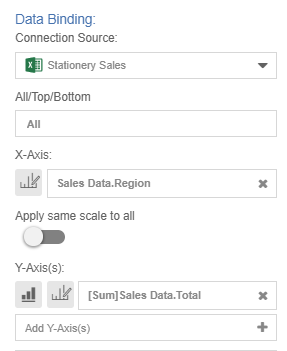

First we connect to the source: **Stationery Sales**. The x-axis represents **region**. Given the structure of the data, to get the **total revenue** in each region we **Sum** the **Total** for the y-axis . This will give the following output:

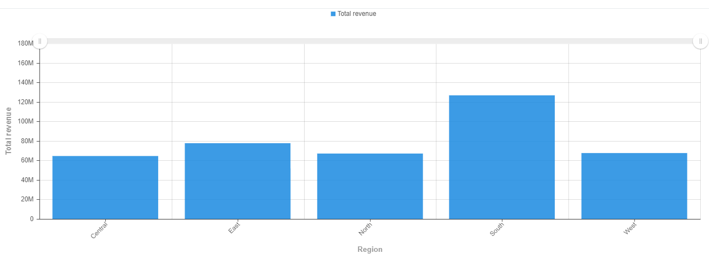

From the graph, we can see the **total revenue** split into each regions but we are not finished. We still want to show the costs among each region.

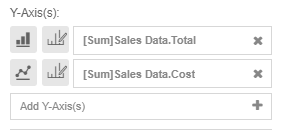

As it is a combination chart, we can combine multiple columns from the y-axis to a single column within the x-axis. Under the y-axis we add the **Sum** of the **Cost** to get the total cost incurred over region. This gives us the following output:

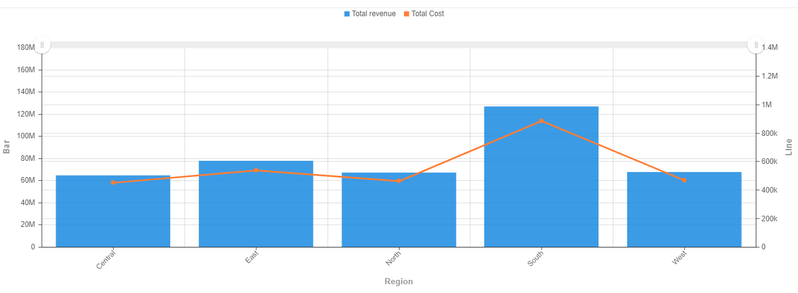

Now we have a chart that shows the **total revenue within regions** represented by a bar chart and the relative **total costs within regions**. Based on the use case and data shown, it does not always have to be represented by a bar chart and a line chart.

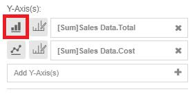

Clicking these square icons denoted by the red square will provide options on what chart type to use. This feature provides a variety of chart types to choose from so make sure to know what chart type to use given the data.

## Example 2 - Multi-Source Combination Charts:

Using multi-source combination charts, we can combine different charts from **different sources** with the data for x-axis and y-axis originating from multiple sources. In this example, we will be showcasing the **profit growth overall and grouped by years over months**. Instead of having two graphs to showcase the combined and separate profit growth over years, we can combine it into a single chart. In this example, we will be using a source called **dhl-profit-growth.xlsx**.

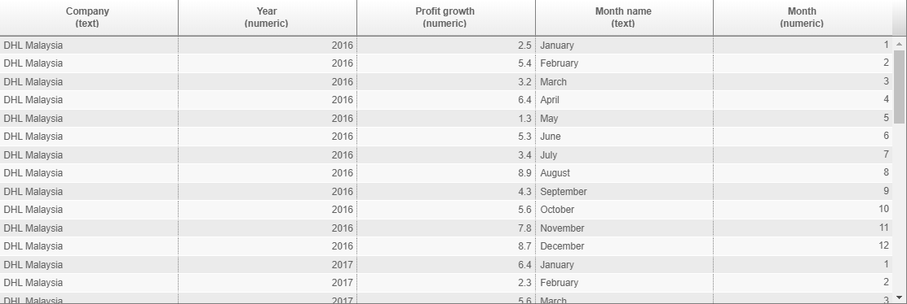

This is the structure of the data. It shows the profit growth for DHL Malaysia across months.

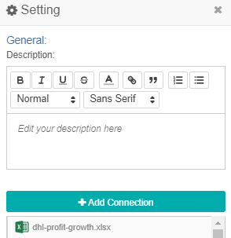

Under settings, there is an **Add Connection** button where we can choose multiple sources. In this case we are going to use the same source in order to show the **combined profit growth and separate profit growth over years by months**.

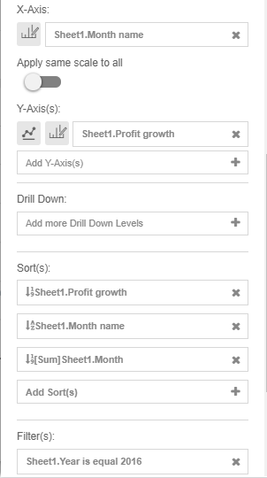

We choose our x-axis to **Month_name** and the y-axis to be **Profit_growth**. We order by our column **Month** to order the month names on the x-axis. We filter when the year is equal to **2016**.

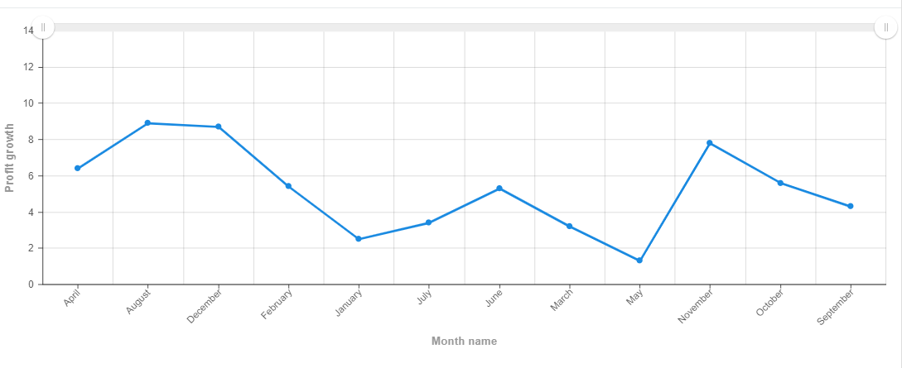

This shows the profit growth just in 2016. We now must repeat the binding shown above but for each binding filtering out the different years. Since one of the bindings will represent the profit growth of all the years combined, we do not need to filter out anything for that specifed binding.

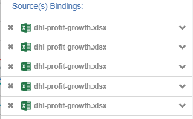

We do this by adding multiple connection sources but using the same source: **dhl-profit-growth.xlsx**. All these added connection sources represent different years and the total profit growth.

This is the given output: 

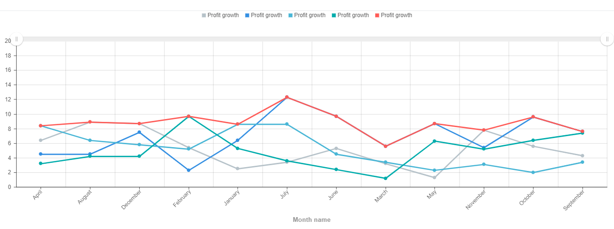

Now the graph shows separate lines which represents the profit growth for 2016, 2017, 2018, 2019 and for all years.

## GIANT's Built-In Functions:

**Unique** - Counts the distinct values within the column chosen. For example, if the data contains multiple names, it only takes into account a unique name once. This is particularly useful when wanting to know how many unique users exist in the consumer base.

**Count** - Counts the number of rows within a column.

**Maximum** - Takes the maximum value within a column.

**Minimum** - Takes the minimum value within a column.

**Sum** - Sums the numeric values within a column.

**Average** - Takes the average value within a column.

**None** - Does not affect the column. Used when the current data is already aggregated.

**Group By** - Used to look at the data within different groups of the data. For example: **Sales by Store ID for different Age Groups**.

**Sort** - Sorts the data in Ascending/Descending order depending on the data type.

**Filter** - Allows choosing columns within the table to filter specific criteria for the data.

## Important Notes:

- A Multi-combination chart contains charts that are normally used to show summary or overviews for comparison. If there are a large number of data points that requires legends or data labels, it can get very messy.

- There is something wrong with the legend feature, it is a behind the scenes problem. Add **rich text** to explain what each line actually represents or what your chart represents depending on the data.

- Depending on the use case, using different charts provided by the options of the multi-source may be ideal.
